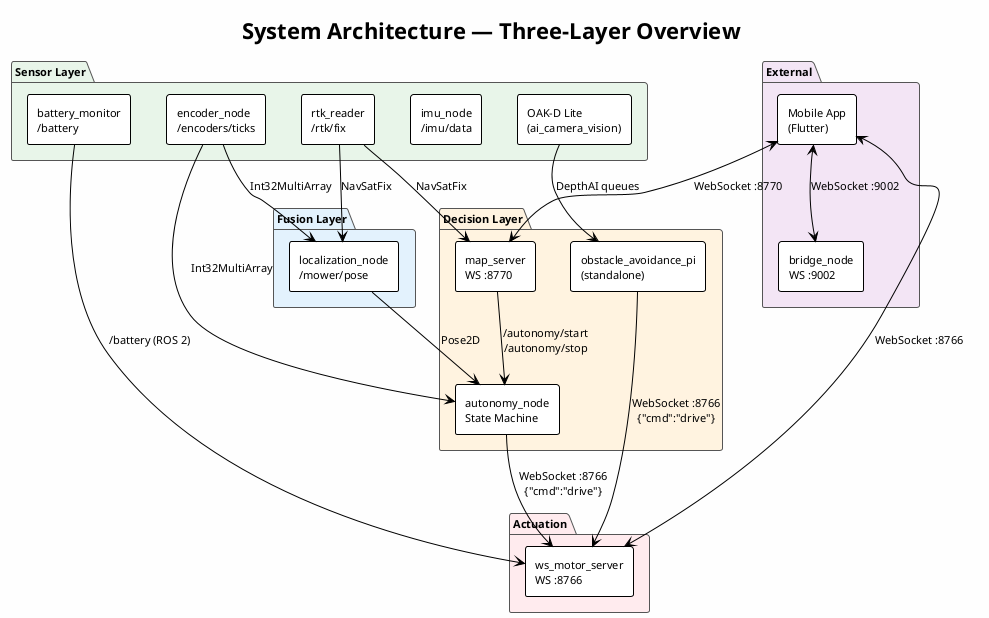
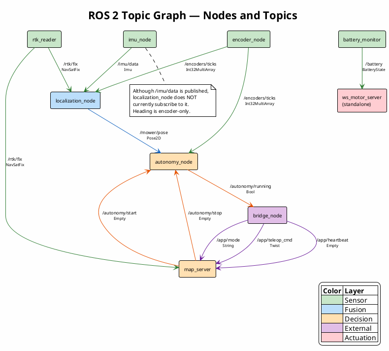
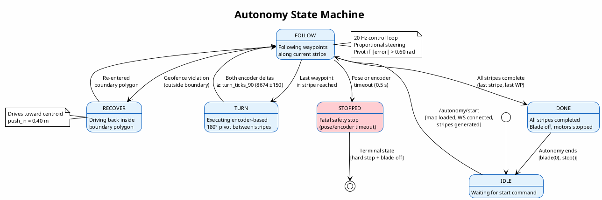
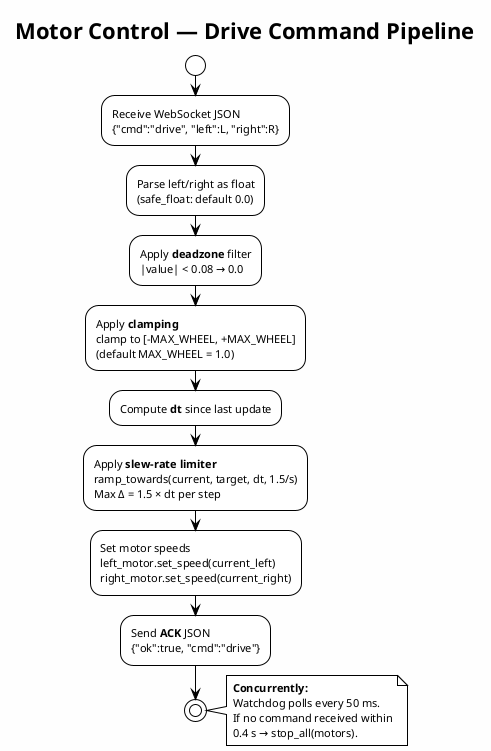
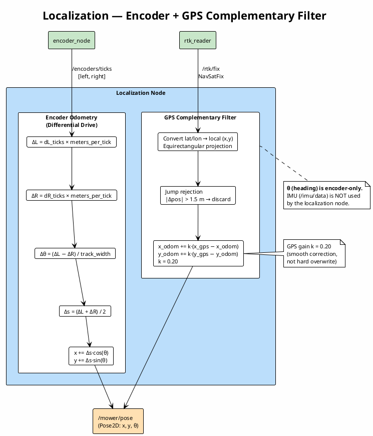
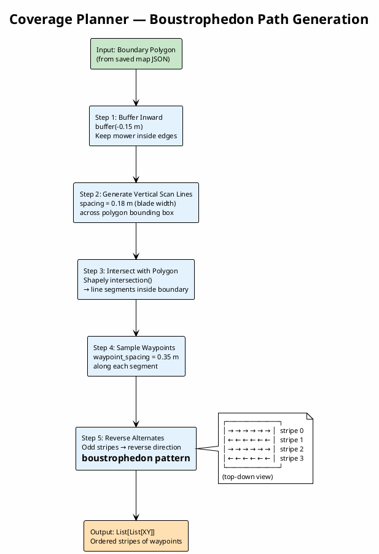
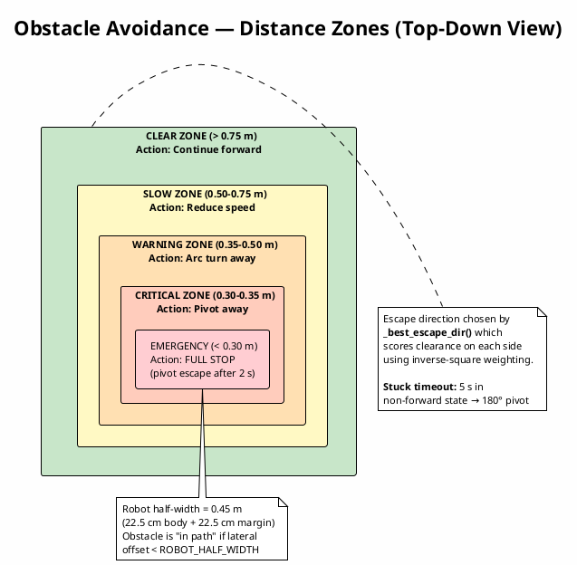
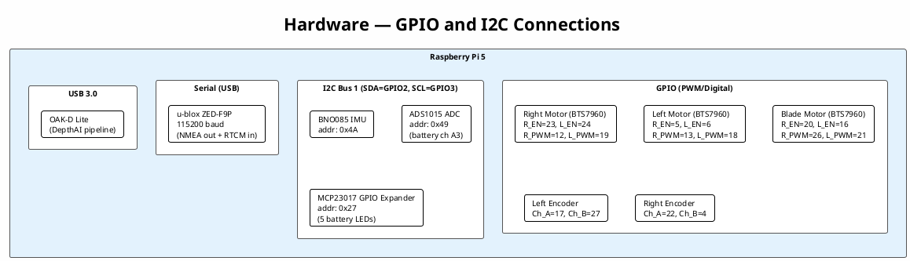
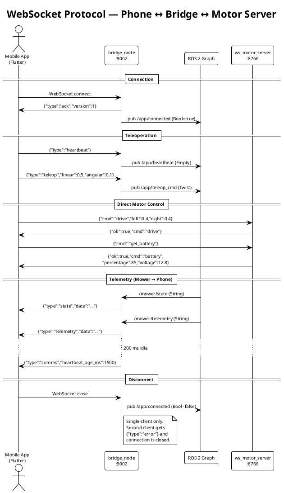
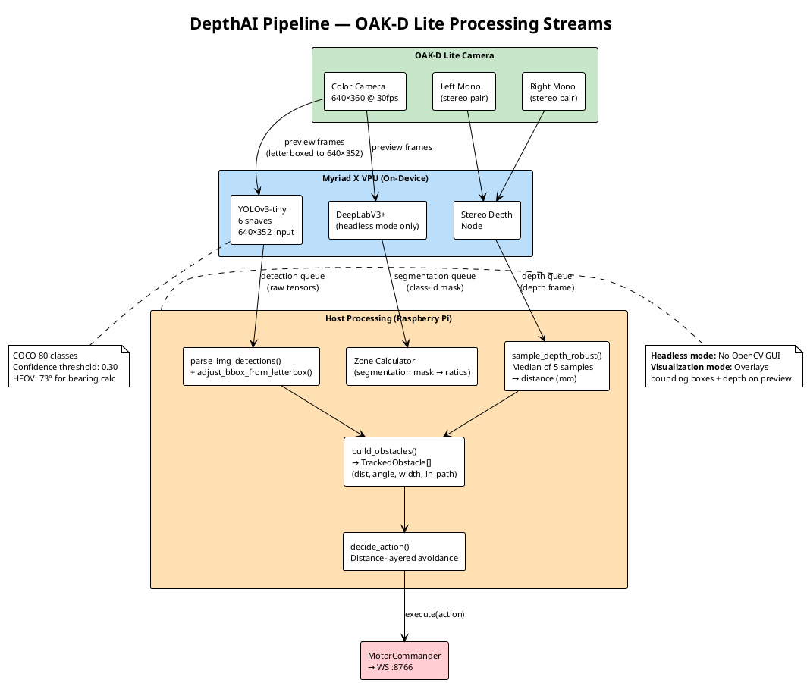

# Missing Paragraphs & PlantUML Diagrams

---

## Part 1: Missing Paragraphs (with placement)

---

### 1. GPS Jump Rejection → Add to Section 5.9 (Localization), after the GPS correction paragraph

> **Place after the paragraph describing GPS complementary filter correction (Section 5.9.4).**

**GPS Jump Rejection.** To guard against erroneous GPS updates caused by multi-path reflection or momentary signal loss, the localization node implements a jump rejection filter. When a new GPS fix arrives, the Euclidean distance between the new position and the previous accepted GPS position is computed. If this distance exceeds the configurable `max_gps_jump_m` threshold (default: 1.5 m), the fix is discarded and a warning is logged. This prevents a single bad satellite solution from teleporting the mower's estimated position across the lawn, which would otherwise trigger a false geofence violation and an unnecessary recovery maneuver.

---

### 2. Map Origin Loading → Add to Section 5.9 (Localization), as a new paragraph before the GPS correction paragraph

> **Place as a new paragraph at the beginning of Section 5.9.4 (GPS Correction), before describing how GPS corrections work.**

**Map Origin Initialization.** On startup, the localization node attempts to load the most recently saved map file from `~/mower_ws/maps/` using the `load_latest_map()` utility. If a valid map is found, its stored origin latitude and longitude are adopted as the local coordinate frame origin [(lat₀, lon₀)](file:///c:/Users/samyb/Downloads/lawnbot_backup/mower_ws/src/obstacle_detection/obstacle_avoidance_pi.py#255-390). This ensures that the encoder odometry frame is aligned with the coordinate system used during boundary recording, eliminating the need to wait for a live GPS fix before the mower can localize within its saved map. If no valid map is found, the node falls back to setting the origin from the first RTK-quality GPS fix received at runtime.

---

### 3. Navigation Commands via Map Server → Add to Section 5.11.5

> **Add as a new paragraph at the end of Section 5.11.5 (State Machine and Storage), after the WebSocket commands paragraph.**

**Autonomy Control Relay.** In addition to the six mapping commands, the map server WebSocket interface exposes two navigation control commands: `start_navigation` and `stop_navigation`. When received from the mobile application, these commands publish `std_msgs/Empty` messages on the `/autonomy/start` and `/autonomy/stop` topics, respectively. This design allows the mobile application to trigger autonomous mowing through the same WebSocket connection used for map management, without requiring a direct connection to the autonomy node or knowledge of ROS 2 topic conventions.

---

### 4. Bridge `/app/connected` Topic → Add to Section 5.13.2

> **Add as an additional row to Table 5.10 (Inbound WebSocket Messages), and a brief sentence after the table.**

Add this row to **Table 5.10**:

| Message Type | ROS 2 Action | Published Topic |
|---|---|---|
| *(connection event)* | Publish `Bool` (true on connect, false on disconnect) | `/app/connected` |

And add this sentence after the table:

Additionally, the bridge publishes a `Bool` message on `/app/connected` whenever a client connects (`true`) or disconnects (`false`). This allows other ROS 2 nodes to monitor whether the mobile application is actively linked to the mower.

---

### 5. Fake Telemetry Node → Add to Section 5.13 (Communication Bridge)

> **Add as a brief note at the end of Section 5.13.3 (Threading Model) or as a short new subsection 5.13.4.**

**5.13.4 Testing Utility.** The `lawnbot_comms` package includes a `fake_telemetry_node` that publishes synthetic `/mower/state` and `/mower/telemetry` messages. This node was used during development to validate the WebSocket bridge and mobile application without requiring the full mower hardware stack to be running. It is not included in the production launch file.

---

### 6. Blade Speed Clamping → Add to Section 5.2.3

> **Add as a note at the end of the "Obstacle Avoidance Integration" paragraph or as a new paragraph after it in Section 5.2.3.**

**Blade Speed Limiting.** The WebSocket server enforces a hard clamp on blade motor speed, restricting it to the range [0.0, 0.1] regardless of the requested value. This safety limit was introduced during development to prevent the blade from reaching full speed during integration testing. The autonomy node commands blade speed 1.0 when starting autonomous mowing, but the motor server overrides this to 0.1 at the protocol level. This intentional mismatch ensures that the blade cannot exceed the tested safe operating speed without a deliberate configuration change on the motor server side.

> [!NOTE]
> Confirm whether 0.1 is the intended production value or a leftover testing safeguard so you can describe it accurately.

---

## Part 2: PlantUML Diagrams

---

### Diagram 1 — System Architecture (3-Layer Block Diagram)

---

### Diagram 2 — ROS 2 Topic Graph

---

### Diagram 3 — Autonomy State Machine

---

### Diagram 4 — Motor Control Data Flow

---

### Diagram 5 — Localization Fusion

---

### Diagram 6 — Coverage Planner

---

### Diagram 7 — Obstacle Avoidance Zones

---

### Diagram 8 — Hardware I2C/GPIO Wiring

---

### Diagram 9 — WebSocket Protocol Sequence

---

### Diagram 10 — DepthAI Pipeline

