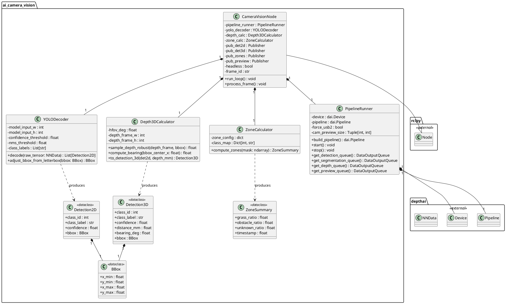
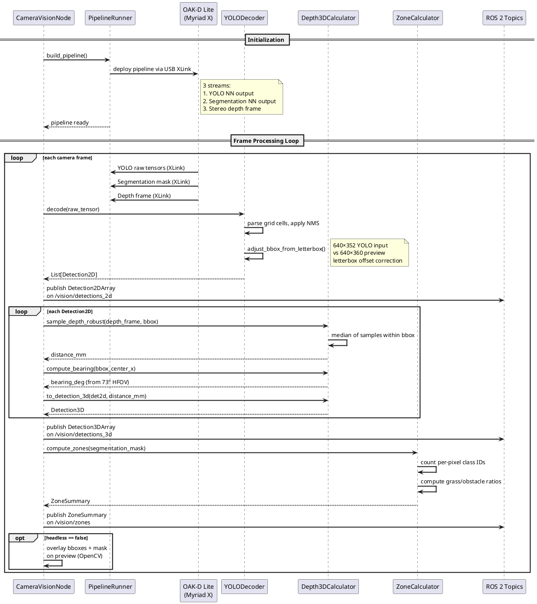
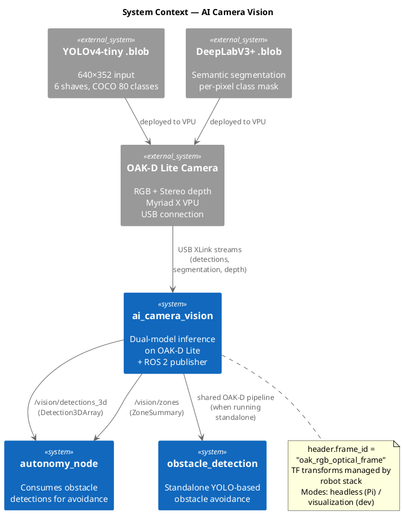

# Software Design — AI Camera Vision (`ai_camera_vision`)

## 1. Overview

The `ai_camera_vision` package implements a dual-model neural network inference pipeline on the OAK-D Lite stereo camera. The DepthAI pipeline runs YOLOv4-tiny object detection and DeepLabV3+ semantic segmentation on the Myriad X VPU, while the host (Raspberry Pi) decodes raw tensors, computes 3D obstacle distances using stereo depth, and publishes results as ROS 2 topics.

### 1.1 Design Rationale

All neural network inference runs on-device (Myriad X VPU) to keep the Raspberry Pi CPU free for control logic. The host only performs lightweight post-processing: YOLO tensor decoding, depth sampling, and zone calculation. Two deployment modes (visualization for development, headless for production) are controlled by a single toggle, ensuring minimal overhead in the field.

### 1.2 Key Responsibilities

- Construct and deploy DepthAI pipeline (RGB camera + YOLO NN + segmentation NN + stereo depth)
- Decode raw YOLO tensors into Detection2D structures with letterbox-corrected bounding boxes
- Sample stereo depth within detection bounding boxes for 3D distance/bearing estimation
- Compute segmentation zone ratios (grass %, obstacle %) from the per-pixel class mask
- Publish detections, 3D detections, and zone summaries on `/vision/*` topics
- Optional OpenCV visualization overlay for development

---

## 2. Class Diagram



---

## 3. Sequence Diagram



---

## 4. System Context Diagram



---

## 5. Detailed Design

### 5.1 DepthAI Pipeline Architecture

The pipeline deployed to the OAK-D Lite consists of three parallel processing streams sharing a single RGB camera input:

| Stream | Model | Input Size | Output | Shaves |
|---|---|---|---|---|
| YOLO Detection | YOLOv4-tiny (.blob) | 640×352 | Raw detection tensors | 6 |
| Segmentation | DeepLabV3+ (.blob) | Model-specific | Per-pixel class-id mask | Shared |
| Stereo Depth | Built-in stereo | Camera native | Depth frame (mm) | N/A |

### 5.2 Letterbox Handling

The YOLO model expects 640×352 input while the camera produces 640×360 (16:9). Letterboxing preserves the full ~81° horizontal FOV with 4-pixel black bars at top and bottom. The `adjust_bbox_from_letterbox()` function corrects bounding box y-coordinates by subtracting the letterbox offset, ensuring accurate pixel-to-world coordinate mapping.

### 5.3 Depth Sampling

For each YOLO detection, `sample_depth_robust()` takes the median of multiple depth samples within the bounding box region. The median rejects outlier depth values (e.g., background pixels at bbox edges). Depth in millimeters is combined with the detection's horizontal pixel position and the camera's 73° HFOV to compute bearing angle:

```
bearing = (bbox_center_x / frame_width - 0.5) × HFOV
```

### 5.4 Segmentation Zones

The `ZoneCalculator` converts the per-pixel class-id mask into zone ratios by counting pixel class frequencies. The output `ZoneSummary` reports the fraction of the frame occupied by grass, obstacles, and unknown classes.

### 5.5 Deployment Modes

| Mode | OpenCV | File I/O | Use Case |
|---|---|---|---|
| Headless | Disabled | ROS 2 logging only | Production on Raspberry Pi |
| Visualization | Enabled (overlay) | Optional JSONL | Development and debugging |

### 5.6 USB Mode Selection

| Platform | USB Mode | Rationale |
|---|---|---|
| Development PC | USB3 (5 Gbps) | Higher FPS for rapid iteration |
| Raspberry Pi | USB2 (480 Mbps) | More stable power, avoids brownout resets |

Configurable via the `force_usb2` parameter in `PipelineRunner`.

### 5.7 Published Topics

| Topic | Message Type | Content |
|---|---|---|
| `/vision/detections_2d` | `vision_msgs/Detection2DArray` | 2D bounding boxes with class and confidence |
| `/vision/detections_3d` | `vision_msgs/Detection3DArray` | 3D detections with distance and bearing |
| `/vision/zones` | Custom `ZoneSummary` | Grass/obstacle/unknown ratios |
| `/vision/status` | Diagnostics | FPS, latency, error states |

### 5.8 Schema Versioning

All published messages include `schema_version` in metadata (ADR-005). The canonical schema is defined in `schema-v1.md`. Detection messages include model name, input dimensions, and sequence number for replay and debugging.
