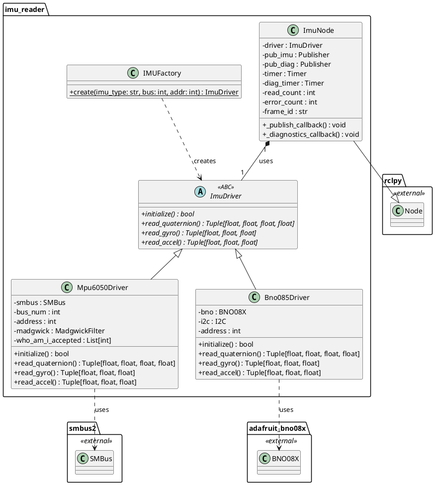
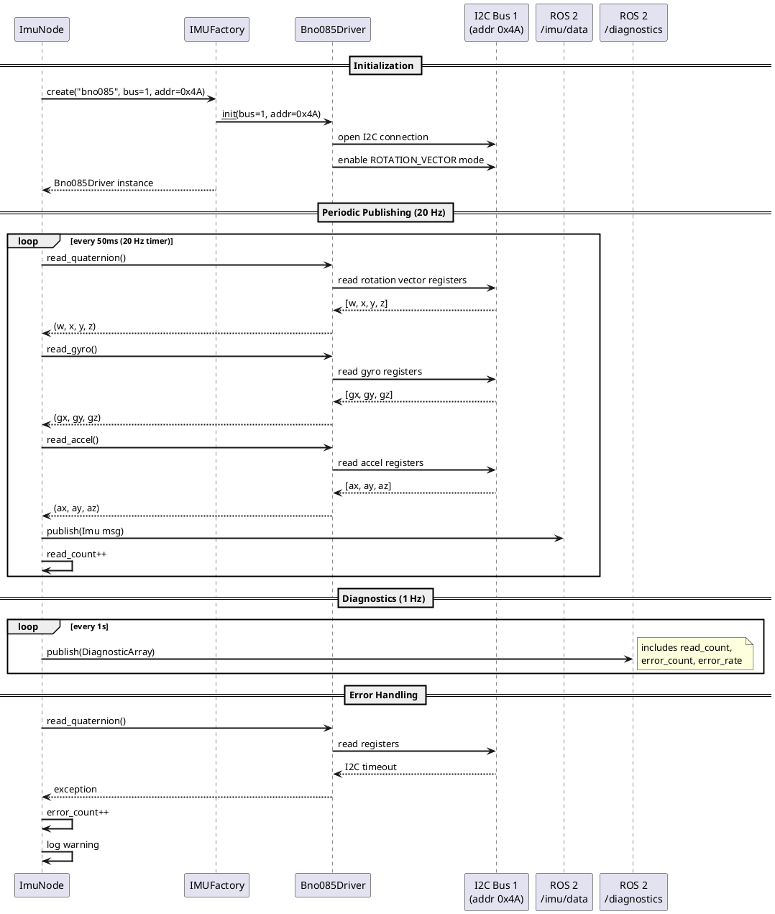
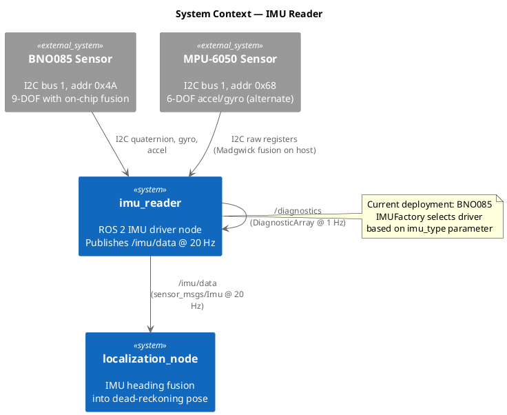

# Software Design — IMU Reader (`imu_reader`)

## 1. Overview

The `imu_reader` package provides a ROS 2 node that abstracts IMU sensor hardware behind a Factory pattern, supporting both the Adafruit BNO085 (9-DOF with on-chip sensor fusion) and the MPU-6050/MPU-6500 (6-DOF accelerometer/gyroscope). The node publishes `sensor_msgs/Imu` messages on `/imu/data` and diagnostics on `/diagnostics`.

### 1.1 Design Rationale

The Factory pattern (`IMUFactory`) decouples the ROS 2 node from sensor-specific initialization, allowing hardware swaps (BNO085 ↔ MPU-6050) without modifying the node logic. The current deployment uses the BNO085 in `ROTATION_VECTOR` mode, which provides a pre-fused quaternion at ~100 Hz. The MPU-6050 driver applies a software Madgwick filter to produce quaternion orientation from raw accelerometer/gyroscope data.

### 1.2 Key Responsibilities

- Initialize the correct IMU driver based on the `imu_type` parameter
- Read angular velocity, linear acceleration, and quaternion orientation at configurable rate
- Publish `sensor_msgs/Imu` on `/imu/data` (default ~20 Hz)
- Publish `diagnostic_msgs/DiagnosticArray` on `/diagnostics` (1 Hz)
- Report sensor health metrics (read count, error rate)

---

## 2. Class Diagram

---

## 3. Sequence Diagram

---

## 4. System Context Diagram

---

## 5. Detailed Design

### 5.1 Factory Pattern

The `IMUFactory.create()` method accepts a string (`"bno085"` or `"mpu6050"`) and returns the appropriate `ImuDriver` subclass. This allows the `ImuNode` to remain agnostic to the physical sensor, enabling hardware swaps through a single parameter change.

### 5.2 BNO085 Driver

- Communicates over I2C at address `0x4A` using `adafruit-circuitpython-bno08x` (v1.3.1)
- Configured in `ROTATION_VECTOR` mode for ARVR-stabilized quaternion output
- Sensor fusion runs on the BNO085's built-in ARM Cortex-M0+ processor
- Outputs quaternion orientation at approximately 100 Hz (node publishes at ~20 Hz)

### 5.3 MPU-6050 Driver

- Communicates over I2C at address `0x68` using `smbus2` for direct register access
- Reads raw 16-bit accelerometer and gyroscope values with configurable sensitivity scaling
- `WHO_AM_I` register check accepts `0x68`, `0x70`, `0x71`, `0x73` to accommodate MPU-6500 variants
- A software Madgwick filter computes quaternion orientation from raw sensor data

### 5.4 Published Message Fields

The `sensor_msgs/Imu` message on `/imu/data` contains:

| Field | Source (BNO085) | Source (MPU-6050) |
|---|---|---|
| `orientation` (quaternion) | On-chip ROTATION_VECTOR | Host-side Madgwick filter |
| `angular_velocity` (x,y,z) | On-chip gyro output | Raw gyro registers, scaled |
| `linear_acceleration` (x,y,z) | On-chip accel output | Raw accel registers, scaled |
| `header.frame_id` | `"imu_link"` | `"imu_link"` |

### 5.5 Diagnostics

The diagnostics callback at 1 Hz publishes a `DiagnosticArray` containing:
- `imu_type`: active driver name
- `read_count`: total successful readings since startup
- `error_count`: total I2C read failures
- `error_rate`: `error_count / read_count` (fraction)
- Status level: `OK` if error_rate < 5%, `WARN` if < 20%, `ERROR` otherwise

### 5.6 Parameters

| Parameter | Type | Default | Description |
|---|---|---|---|
| `imu_type` | string | `"bno085"` | Driver selection (`"bno085"` or `"mpu6050"`) |
| `i2c_bus` | int | 1 | I2C bus number |
| `i2c_address` | int | 0x4A (BNO) / 0x68 (MPU) | Sensor I2C address |
| `publish_rate` | float | 20.0 | Publishing frequency in Hz |
| `frame_id` | string | `"imu_link"` | TF frame ID for message headers |
