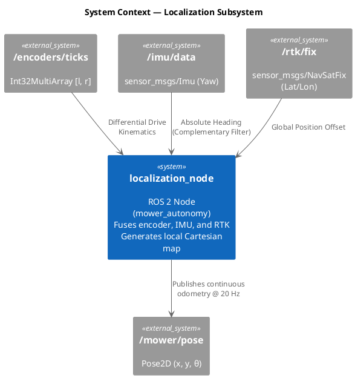
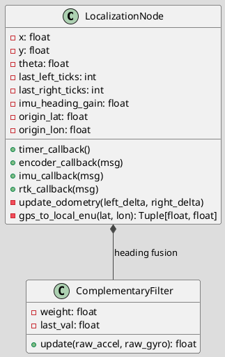
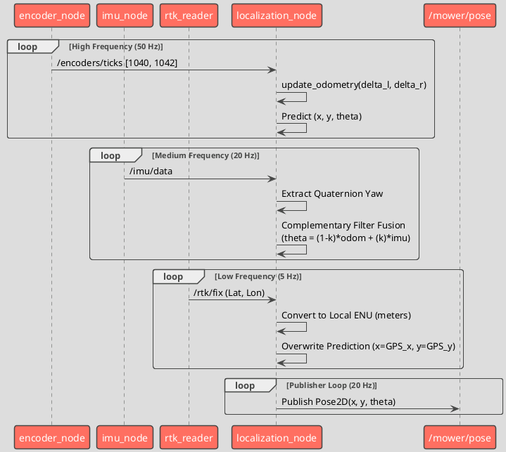

# Sensor Integration (Localization): Software Design

> **Note:** The `sensor_integration` package and EKF pipeline are deprecated. Localization is now actively performed by `mower_autonomy/localization_node.py`. This design document reflects the active localization implementation.

## 1. System / Component Diagram

This diagram shows how `localization_node` fuses raw sensor data into a continuous `Pose2D`.

### Component Details
- **localization_node**: Subscribes to three distinct sensor modalities. Uses encoder ticks for high-frequency motion tracking (differential drive kinematics), IMU for drift-free heading, and RTK-GPS for absolute Cartesian position correction.
- **/mower/pose**: Outputs a highly stable local Cartesian coordinate map (meters) suitable for exact waypoint navigation and path following.

---

## 2. Class Diagram

### Class Details
- **LocalizationNode**: Maintains the current integrated state vector `(x, y, theta)`. Because NavSat properties provide global position, the node establishes a *(0,0)* origin at the first GPS fix and uses the equirectangular approximation to continuously align the dead-reckoning (ticks + IMU) to the absolute world position. 
- **Complementary Filter**: Applies the `imu_heading_gain` to blend raw encoder heading (susceptible to wheel slip) with IMU heading (absolute but optionally noisy in sharp jerks).

---

## 3. Sequence Diagram

This sequence diagram illustrates how the different asynchronous sensor feeds are fused to provide a continuous Pose2D output.

### Sequence Flow Details
- **Prediction Step**: Every time encoder ticks arrive, the node mathematically drives the current pose forward along `theta`. 
- **Orientation Correction**: The IMU updates asynchronously to drag the predicted heading towards truth, dampening cumulative wheel slip error.
- **Position Correction**: The RTK fix snaps the dead-reckoned X/Y coordinates to their true global offsets, eliminating coordinate drift without requiring a heavy EKF covariance matrix.
