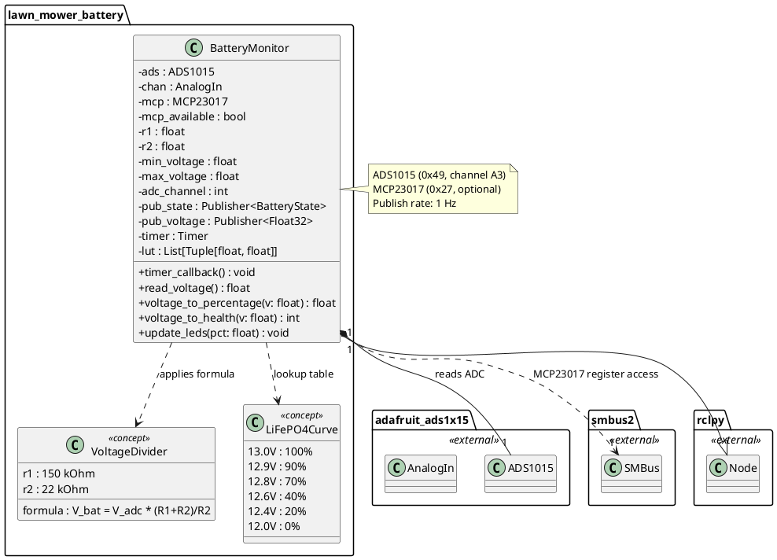
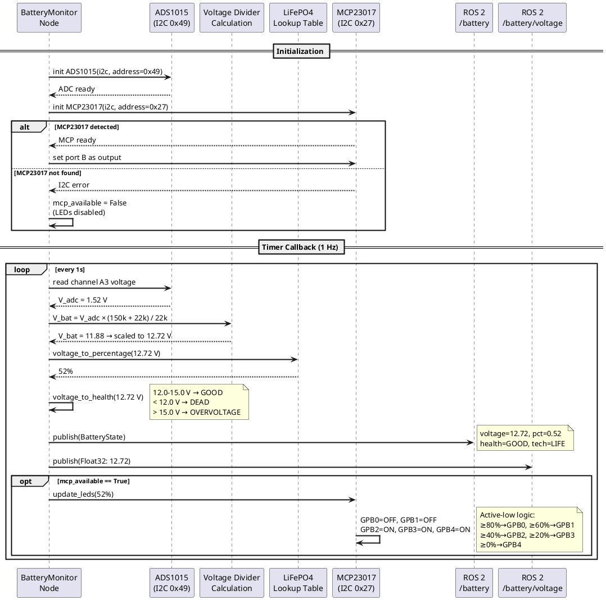
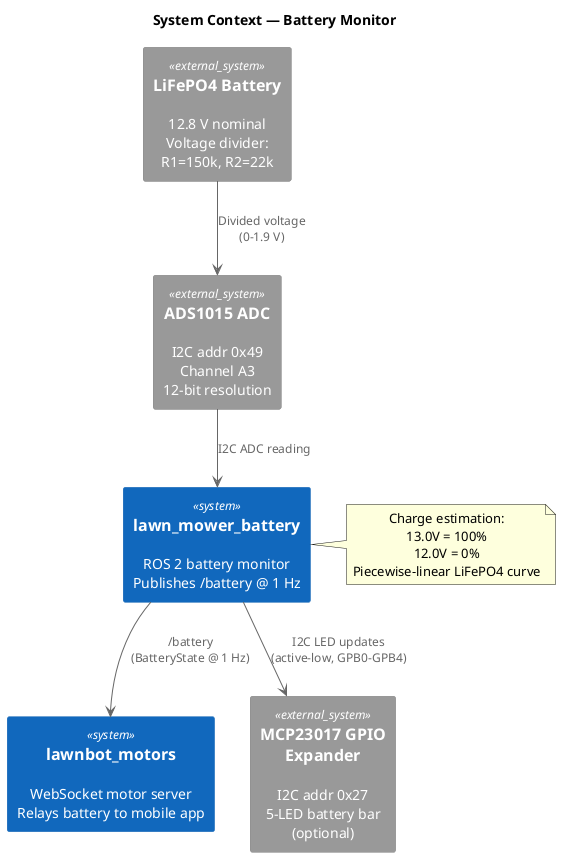

# Software Design — Battery Monitor (`lawn_mower_battery`)

## 1. Overview

The `lawn_mower_battery` package implements a ROS 2 node that monitors a 12.8 V LiFePO4 battery through a resistive voltage divider connected to an ADS1015 12-bit ADC. It estimates state of charge using a piecewise-linear LiFePO4 discharge curve, optionally drives a 5-LED battery bar via an MCP23017 GPIO expander, and publishes battery state on ROS 2 topics.

### 1.1 Design Rationale

The ADS1015 ADC was chosen because the Raspberry Pi lacks native analog inputs. A voltage divider (R1=150 kOhm, R2=22 kOhm) scales the 12.8 V battery voltage to the ADC's 0–3.3 V input range. The MCP23017 LED bar is treated as optional — if not detected on the I2C bus, LEDs are silently disabled without affecting battery monitoring.

### 1.2 Key Responsibilities

- Read battery voltage through the ADS1015 ADC voltage divider
- Estimate state of charge using LiFePO4 discharge curve lookup
- Classify battery health (good, dead, overvoltage)
- Drive 5-LED battery bar via MCP23017 (optional)
- Publish `sensor_msgs/BatteryState` on `/battery` at 1 Hz
- Publish `std_msgs/Float32` on `/battery/voltage` at 1 Hz

---

## 2. Class Diagram



---

## 3. Sequence Diagram



---

## 4. System Context Diagram



---

## 5. Detailed Design

### 5.1 Voltage Measurement

The battery voltage is measured through a resistive voltage divider:

```
V_battery = V_adc × (R1 + R2) / R2
V_battery = V_adc × (150000 + 22000) / 22000
V_battery = V_adc × 7.818
```

The ADS1015 is read at I2C address `0x49` on channel A3 (A0 is reserved for blade RPM sensing). Address `0x48` is faulty and produces a constant offset.

### 5.2 State of Charge Estimation

A piecewise-linear interpolation of the LiFePO4 discharge curve maps voltage to percentage:

| Voltage | Charge |
|---|---|
| ≥ 13.0 V | 100% |
| 12.9 V | 90% |
| 12.8 V | 70% |
| 12.6 V | 40% |
| 12.4 V | 20% |
| ≤ 12.0 V | 0% |

Linear interpolation is used between table entries for smooth percentage transitions.

### 5.3 Health Assessment

| Condition | Voltage | Health Status |
|---|---|---|
| Normal operation | 12.0–15.0 V | `POWER_SUPPLY_HEALTH_GOOD` |
| Depleted | < 12.0 V | `POWER_SUPPLY_HEALTH_DEAD` |
| Overcharge/fault | > 15.0 V | `POWER_SUPPLY_HEALTH_OVERVOLTAGE` |

### 5.4 LED Indicator

The MCP23017 GPIO expander at I2C address `0x27` drives 5 LEDs on port B (GPB0–GPB4) using active-low logic. A bit cleared to 0 turns the LED ON. The `smbus2` library writes directly to the OLATB register (address `0x15`).

| LED (GPB Pin) | Color | Threshold |
|---|---|---|
| GPB0 | Green | ≥ 80% |
| GPB1 | Green | ≥ 60% |
| GPB2 | Amber | ≥ 40% |
| GPB3 | Amber | ≥ 20% |
| GPB4 | Red | ≥ 0% |

### 5.5 Published Topics

| Topic | Message Type | Rate | Content |
|---|---|---|---|
| `/battery` | `sensor_msgs/BatteryState` | 1 Hz | voltage, percentage, health, technology (LIFE) |
| `/battery/voltage` | `std_msgs/Float32` | 1 Hz | Raw battery voltage in volts |

### 5.6 I2C Bus Map

| Address | Device | Status |
|---|---|---|
| `0x48` | ADS1015 | Faulty (constant offset, not used) |
| `0x49` | ADS1015 | Active — battery (A3), blade RPM (A0) |
| `0x27` | MCP23017 | Optional — LED bar |
| `0x68` | MPU-6050 | Separate subsystem (imu_reader) |
