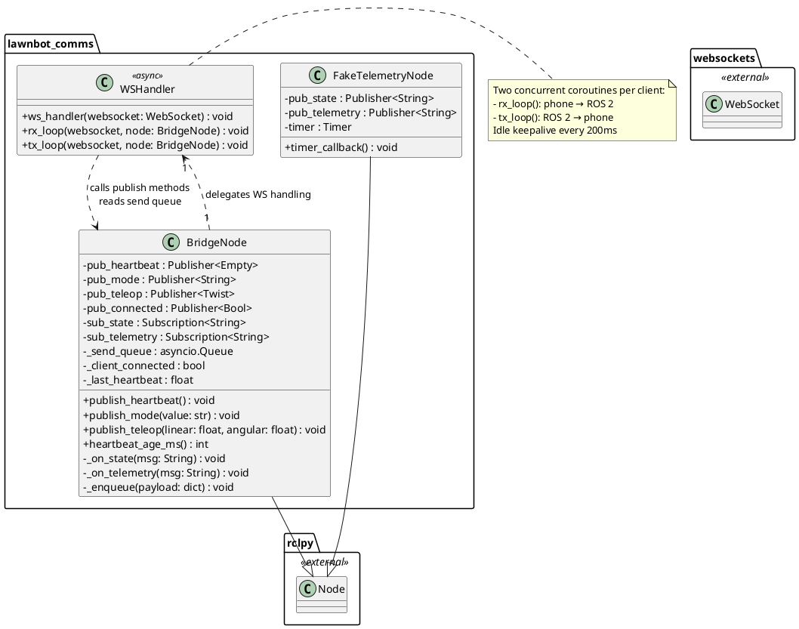
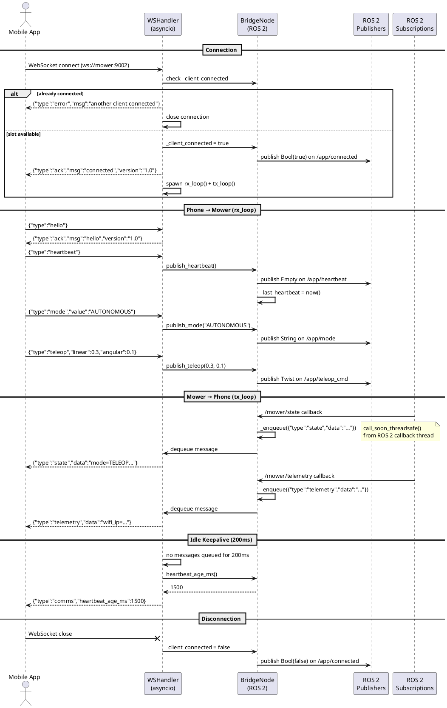
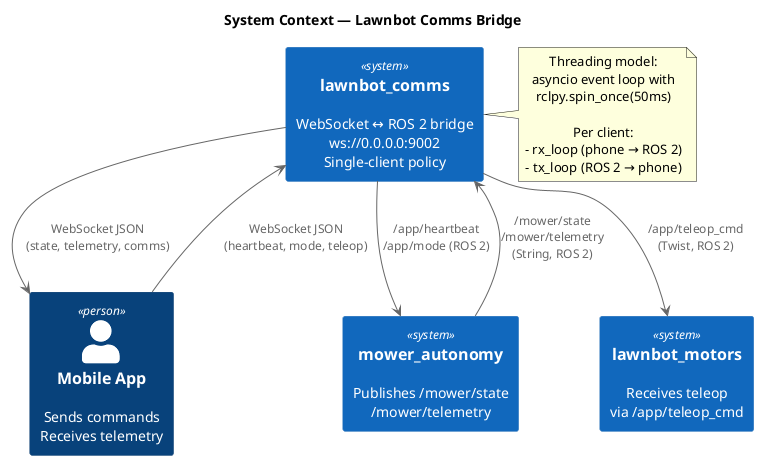

# Software Design — Lawnbot Comms (`lawnbot_comms`)

## 1. Overview

The `lawnbot_comms` package implements a bidirectional WebSocket-to-ROS 2 bridge on port 9002. It translates JSON messages from the mobile app into ROS 2 topic publications (commands) and forwards ROS 2 subscription data back to the app as JSON (telemetry). The bridge enforces single-client connectivity and uses a cooperative asyncio model interleaved with `rclpy.spin_once()`.

### 1.1 Design Rationale

The mobile app communicates over WiFi (phone hotspot) and cannot run a ROS 2 client. WebSocket provides a lightweight, bidirectional transport that works across platforms. The bridge node translates between the two worlds: it publishes ROS 2 messages from phone commands and serializes ROS 2 subscription data into JSON for the phone. A single-client policy simplifies state management and prevents conflicting control inputs.

### 1.2 Key Responsibilities

- Operate WebSocket server on port 9002
- Translate phone commands (heartbeat, mode, teleop) into ROS 2 topic publications
- Forward ROS 2 state and telemetry messages to connected phone as JSON
- Send keepalive `comms` messages every 200 ms when idle
- Enforce single-client connectivity (reject second connections with error)

---

## 2. Class Diagram

---

## 3. Sequence Diagram

---

## 4. System Context Diagram

---

## 5. Detailed Design

### 5.1 Inbound Message Protocol (Phone → Mower)

| Message Type | Fields | ROS 2 Action | Published Topic |
|---|---|---|---|
| `hello` | — | Reply with ACK and version | — |
| `heartbeat` | — | Publish `Empty` | `/app/heartbeat` |
| `mode` | `value: string` | Publish `String` with mode value | `/app/mode` |
| `teleop` | `linear: float, angular: float` | Publish `Twist` | `/app/teleop_cmd` |

### 5.2 Outbound Message Protocol (Mower → Phone)

| Message Type | Source | Trigger |
|---|---|---|
| `ack` | Bridge node | On connection and `hello` |
| `state` | Subscription to `/mower/state` | On ROS 2 message |
| `telemetry` | Subscription to `/mower/telemetry` | On ROS 2 message |
| `comms` | Internal timer | Every 200 ms idle (no queued messages) |
| `error` | Bridge node | On rejected second client |

### 5.3 Threading Model

The bridge uses a cooperative asyncio model with two coroutines per connected client:

- **`rx_loop()`** — Receives JSON from the phone, parses the message type, and calls the appropriate `publish_*()` method on the BridgeNode. Malformed JSON is silently discarded.
- **`tx_loop()`** — Dequeues outgoing messages (enqueued via `call_soon_threadsafe()` from ROS 2 callbacks) and sends them as JSON over WebSocket. If no messages are queued for 200 ms, a `comms` keepalive is sent containing the elapsed time since the last heartbeat.

The main loop alternates between `rclpy.spin_once()` (50 ms timeout) and the asyncio event loop to process both ROS 2 callbacks and WebSocket I/O.

### 5.4 Single-Client Policy

Only one WebSocket client is allowed at a time. The `_client_connected` flag tracks the active connection. If a second client attempts to connect, it receives `{"type":"error","msg":"another client connected"}` and the connection is immediately closed. The flag is reset when the active client disconnects.

### 5.5 Heartbeat Monitoring

The bridge tracks the last heartbeat timestamp from the phone. The `heartbeat_age_ms()` method computes how long ago the last heartbeat was received. This value is included in every `comms` keepalive message, allowing the phone to detect bidirectional link health. Other nodes can also monitor `/app/heartbeat` to detect phone connectivity.

### 5.6 Test Support

A `FakeTelemetryNode` publishes simulated `/mower/state` and `/mower/telemetry` at 5 Hz for testing the bridge without the full mower stack running.
