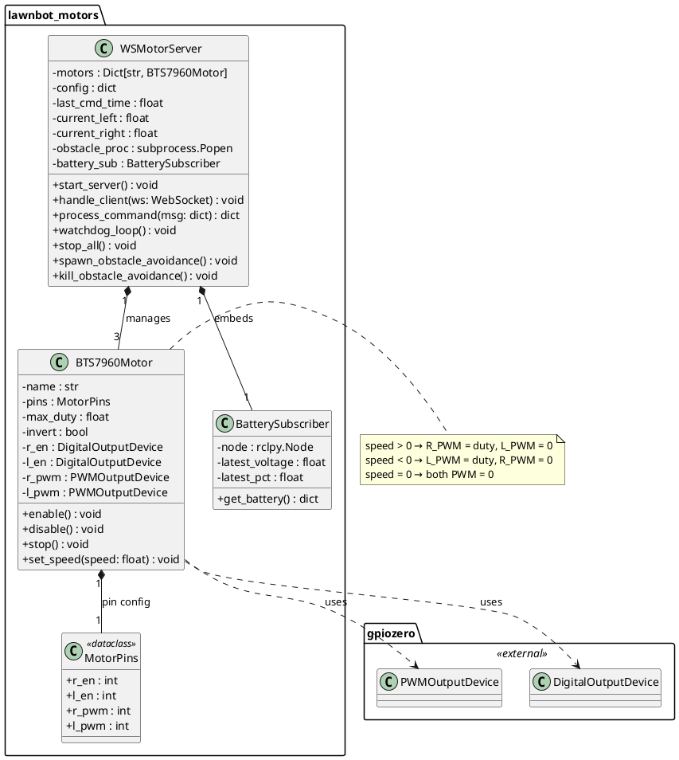
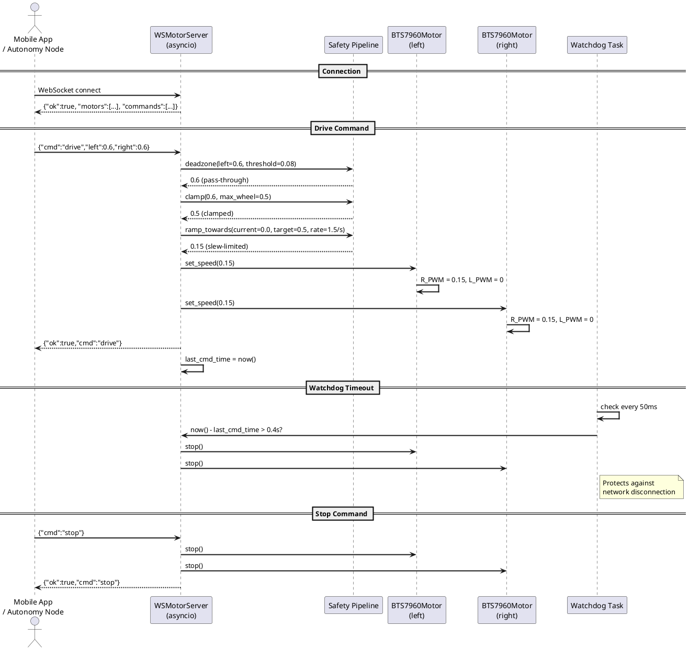
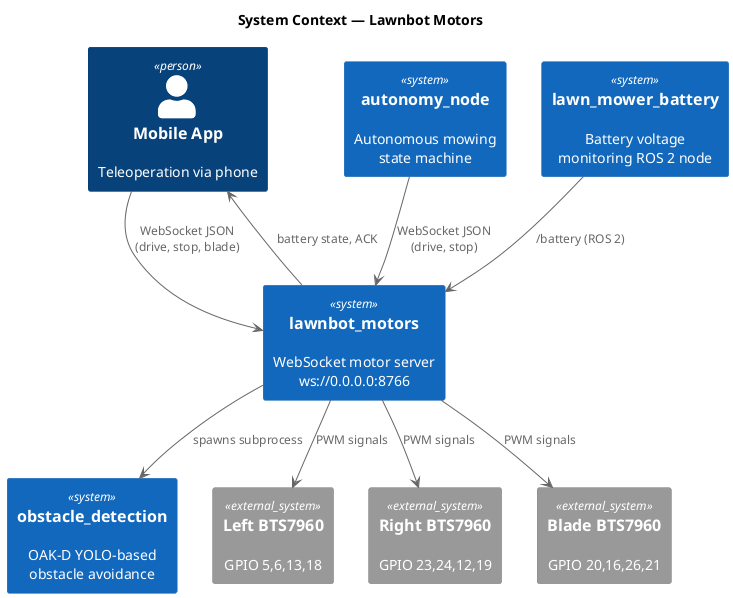

# Software Design — Lawnbot Motors (`lawnbot_motors`)

## 1. Overview

The `lawnbot_motors` package implements a standalone WebSocket motor control server that drives three BTS7960 dual-H-bridge motor drivers (left track, right track, blade) via GPIO PWM on a Raspberry Pi 5. It operates outside the ROS 2 graph as an asyncio process, exposing a JSON-over-WebSocket API on port 8766 for both mobile app teleoperation and autonomous motor commands.

### 1.1 Design Rationale

The motor server is intentionally **not** a ROS 2 node. WebSocket was chosen over `/cmd_vel` because the mobile application requires bidirectional, low-latency command/response communication that is difficult to achieve through ROS 2 topic subscriptions alone. The autonomy node sends differential drive commands directly via WebSocket for minimal latency.

### 1.2 Key Responsibilities

- Accept motor commands via WebSocket (drive, stop, blade, on, set)
- Apply safety processing pipeline: deadzone filtering, clamping, slew-rate limiting
- Drive BTS7960 H-bridges through `gpiozero` PWM
- Enforce a watchdog timeout that stops all motors on communication loss
- Bridge battery state from ROS 2 (`/battery`) to WebSocket clients
- Spawn/terminate the obstacle avoidance subprocess on demand

---

## 2. Class Diagram

---

## 3. Sequence Diagram

---

## 4. System Context Diagram

---

## 5. Detailed Design

### 5.1 Safety Processing Pipeline

Every drive command passes through a three-stage safety pipeline before reaching the motors:

| Stage | Function | Parameters | Purpose |
|---|---|---|---|
| 1. Deadzone | `deadzone(val, threshold)` | threshold = 0.08 | Eliminates motor whine at low joystick inputs |
| 2. Clamping | `clamp(val, -max, +max)` | max_wheel = 1.0 | Prevents over-driving beyond hardware limits |
| 3. Slew-rate | `ramp_towards(current, target, rate×dt)` | rate = 1.5/s | Prevents mechanical shock from sudden speed changes |

### 5.2 Watchdog Timer

The watchdog runs as a concurrent asyncio task polling every 50 ms. If `time.monotonic() - last_cmd_time > 0.4 seconds`, all motors are immediately stopped. This protects against WiFi dropout, app crashes, or any communication interruption during teleoperation or autonomous operation.

### 5.3 Obstacle Avoidance Integration

The `start_obstacle_avoidance` command spawns `obstacle_avoidance_pi.py` as a child subprocess. The `stop_obstacle_avoidance` command terminates it gracefully with SIGTERM, escalating to SIGKILL if the process does not exit within 5 seconds. The obstacle avoidance process connects back to the motor server via a local WebSocket client to issue its own drive commands.

### 5.4 Battery Bridge

An embedded `BatterySubscriber` ROS 2 node subscribes to `/battery` (`sensor_msgs/BatteryState`) and caches the latest voltage and percentage. When a WebSocket client sends `{"cmd":"get_battery"}`, the server replies with the cached battery state. This hybrid design allows the mobile app to access battery data without a direct ROS 2 connection.

### 5.5 Configuration

The `motor_config.yaml` file defines all tunable parameters including GPIO pin assignments, PWM frequency (1000 Hz), teleop limits, and motor-specific max duty cycles. Configuration is loaded at startup via `load_config()` and motors are instantiated through `build_motors_from_config()`.

### 5.6 GPIO Pin Allocation

| Motor | R_EN | L_EN | R_PWM | L_PWM |
|---|---|---|---|---|
| Right track | GPIO 23 | GPIO 24 | GPIO 12 | GPIO 19 |
| Left track | GPIO 5 | GPIO 6 | GPIO 13 | GPIO 18 |
| Blade | GPIO 20 | GPIO 16 | GPIO 26 | GPIO 21 |

### 5.7 Threading Model

The server runs on a single asyncio event loop. Each connected WebSocket client spawns a coroutine handler. The watchdog runs as a concurrent asyncio task. No threading locks are needed since asyncio cooperative multitasking ensures command processing is serialized within the event loop.
