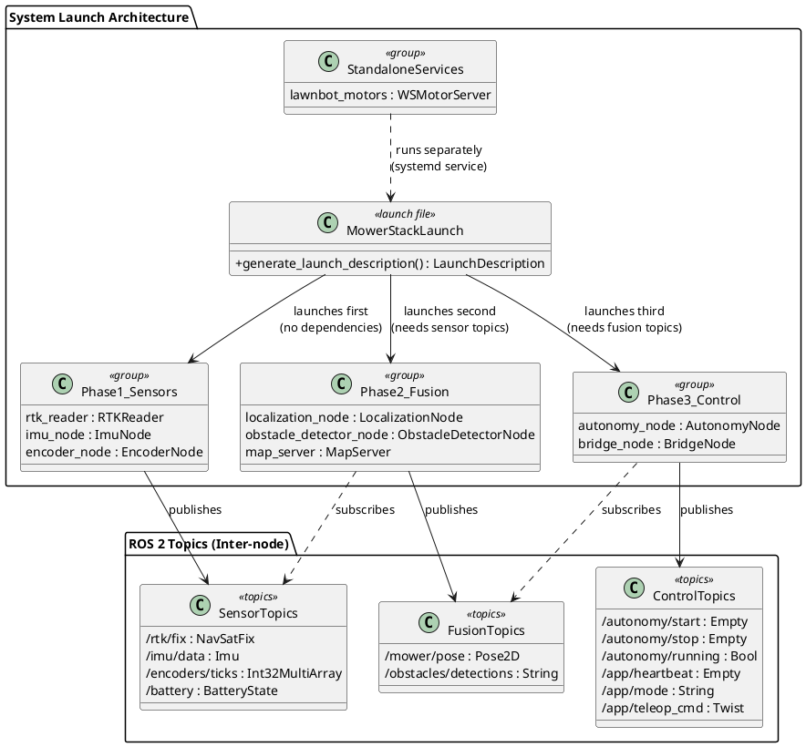
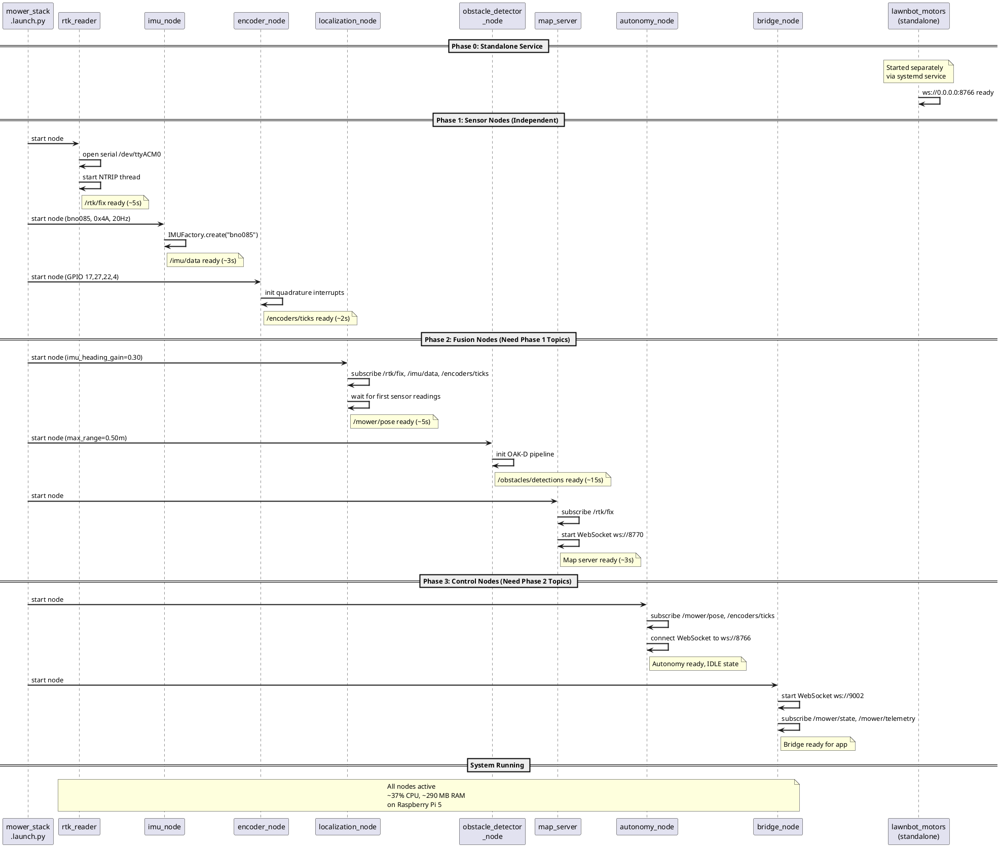
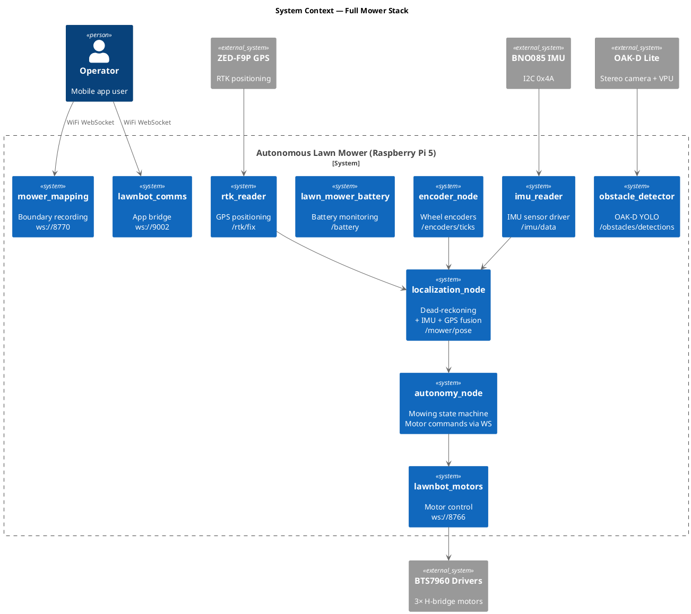

# Software Design — Mower Bringup (`mower_bringup`)

## 1. Overview

The `mower_bringup` package serves as the system-level launch orchestrator for the autonomous lawn mower. The actual launch file (`mower_stack.launch.py`) resides in the `mower_autonomy` package and starts all 8 ROS 2 nodes in dependency order. The `mower_bringup` package exists as a placeholder for future system-wide launch configuration. The `lawnbot_motors` WebSocket server runs separately as a standalone process or systemd service.

### 1.1 Design Rationale

A single launch file starts the entire ROS 2 stack in the correct dependency order. Nodes are grouped into three phases: independent sensor nodes (Phase 1), fusion/processing nodes (Phase 2), and decision/control nodes (Phase 3). This ordering ensures that topics are available before subscribers attempt to use them, minimizing startup race conditions.

### 1.2 Key Responsibilities

- Orchestrate the launch of all ROS 2 nodes in dependency order
- Define the startup configuration (parameters, node names, remappings)
- Document system-wide resource allocation (GPIO, ports, CPU, RAM)
- Ensure no GPIO pin conflicts between packages

---

## 2. Class Diagram

---

## 3. Sequence Diagram

---

## 4. System Context Diagram

---

## 5. Detailed Design

### 5.1 Launch Sequence

| Order | Node | Package | Key Parameters | Dependencies |
|---|---|---|---|---|
| 1 | `rtk_reader` | `rtk_reader` | serial: /dev/ttyACM0 | None |
| 2 | `imu_node` | `imu_reader` | imu_type: bno085, addr: 0x4A | None |
| 3 | `encoder_node` | `mower_autonomy` | la:17, lb:27, ra:22, rb:4 | None |
| 4 | `localization_node` | `mower_autonomy` | imu_heading_gain: 0.30 | /rtk/fix, /imu/data, /encoders/ticks |
| 5 | `obstacle_detector_node` | `mower_autonomy` | max_detection_range_m: 0.50 | None |
| 6 | `autonomy_node` | `mower_autonomy` | — | /mower/pose, /encoders/ticks, map |
| 7 | `map_server` | `mower_mapping` | — | /rtk/fix |
| 8 | `bridge_node` | `lawnbot_comms` | — | ROS 2 topics |
| — | `ws_motor_server` | `lawnbot_motors` | systemd service | Standalone, port 8766 |

### 5.2 Network Port Allocation

| Port | Protocol | Service | Package |
|---|---|---|---|
| 8766 | WebSocket | Motor control | `lawnbot_motors` |
| 8770 | WebSocket | Map recording | `mower_mapping` |
| 9002 | WebSocket | Mobile app bridge | `lawnbot_comms` |

### 5.3 GPIO Allocation (System-Wide)

| GPIO Pins | Function | Package |
|---|---|---|
| 2, 3 | I2C bus 1 (IMU, ADC, GPIO expander) | `imu_reader`, `lawn_mower_battery` |
| 5, 6, 13, 18 | Left motor (BTS7960) | `lawnbot_motors` |
| 23, 24, 12, 19 | Right motor (BTS7960) | `lawnbot_motors` |
| 20, 16, 26, 21 | Blade motor (BTS7960) | `lawnbot_motors` |
| 17, 27, 22, 4 | Wheel encoders (quadrature) | `mower_autonomy` |

No pin conflicts exist between any packages.

### 5.4 Serial Port Allocation

| Port | Device | Package |
|---|---|---|
| `/dev/ttyACM0` | u-blox ZED-F9P GPS | `rtk_reader` |
| USB | OAK-D Lite Camera | `mower_autonomy` (obstacle detection) |

### 5.5 Resource Budget (Raspberry Pi 5, 8 GB RAM)

| Subsystem | CPU (%) | RAM (MB) |
|---|---|---|
| IMU reader + Encoder node | 5 | 40 |
| Localization node | 3 | 30 |
| AI Camera / Obstacle detection | 15 | 100 |
| Autonomy node | 5 | 50 |
| RTK Reader | 3 | 20 |
| Motor Server | 3 | 20 |
| Map Server + Comms Bridge | 3 | 30 |
| **Total** | **~37** | **~290** |

### 5.6 Complete ROS 2 Topic Registry

| Topic | Message Type | Publisher(s) | Subscriber(s) | Rate |
|---|---|---|---|---|
| `/rtk/fix` | `NavSatFix` | `rtk_reader` | `localization_node`, `map_server` | ~5 Hz |
| `/imu/data` | `Imu` | `imu_node` | `localization_node` | ~20 Hz |
| `/encoders/ticks` | `Int32MultiArray` | `encoder_node` | `autonomy_node`, `localization_node` | 50 Hz |
| `/encoders/delta` | `Int32MultiArray` | `encoder_node` | — | 50 Hz |
| `/mower/pose` | `Pose2D` | `localization_node` | `autonomy_node`, `map_server` | ~50 Hz |
| `/obstacles/detections` | `String` (JSON) | `obstacle_detector_node` | `autonomy_node` | ~10 Hz |
| `/battery` | `BatteryState` | `battery_monitor` | `ws_motor_server` | 1 Hz |
| `/battery/voltage` | `Float32` | `battery_monitor` | — | 1 Hz |
| `/autonomy/start` | `Empty` | `map_server` | `autonomy_node` | Event |
| `/autonomy/stop` | `Empty` | `map_server` | `autonomy_node` | Event |
| `/autonomy/running` | `Bool` | `autonomy_node` | — | Event |
| `/autonomy/debug` | `String` | `autonomy_node` | — | 4 Hz |
| `/app/heartbeat` | `Empty` | `bridge_node` | — | Event |
| `/app/mode` | `String` | `bridge_node` | — | Event |
| `/app/teleop_cmd` | `Twist` | `bridge_node` | — | Event |
| `/app/connected` | `Bool` | `bridge_node` | — | Event |
| `/mower/state` | `String` | — | `bridge_node` | — |
| `/mower/telemetry` | `String` | — | `bridge_node` | — |
| `/diagnostics` | `DiagnosticArray` | `imu_node` | — | 1 Hz |

### 5.7 Data Flow Layers

The system data flows through three logical layers:

1. **Sensor Layer** — `rtk_reader`, `imu_reader`, `encoder_node`, `lawn_mower_battery` publish raw sensor data
2. **Fusion Layer** — `localization_node` consumes sensor topics and produces the fused pose estimate (`/mower/pose`)
3. **Decision Layer** — `autonomy_node`, `obstacle_detector_node`, and `mower_mapping` consume the fused state and produce motor commands or map data
