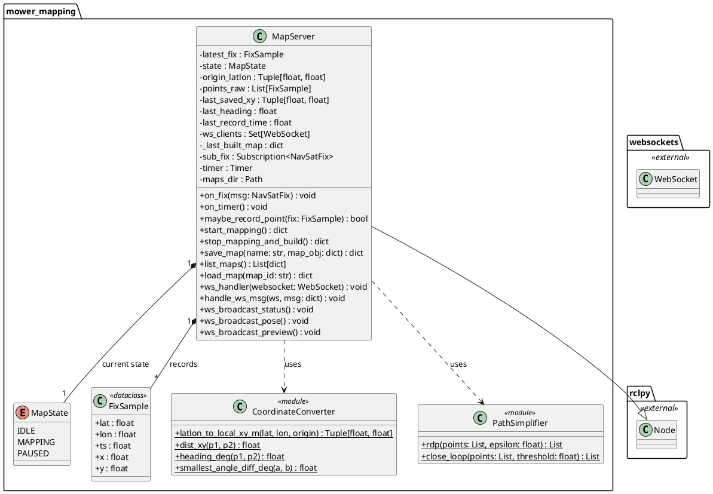
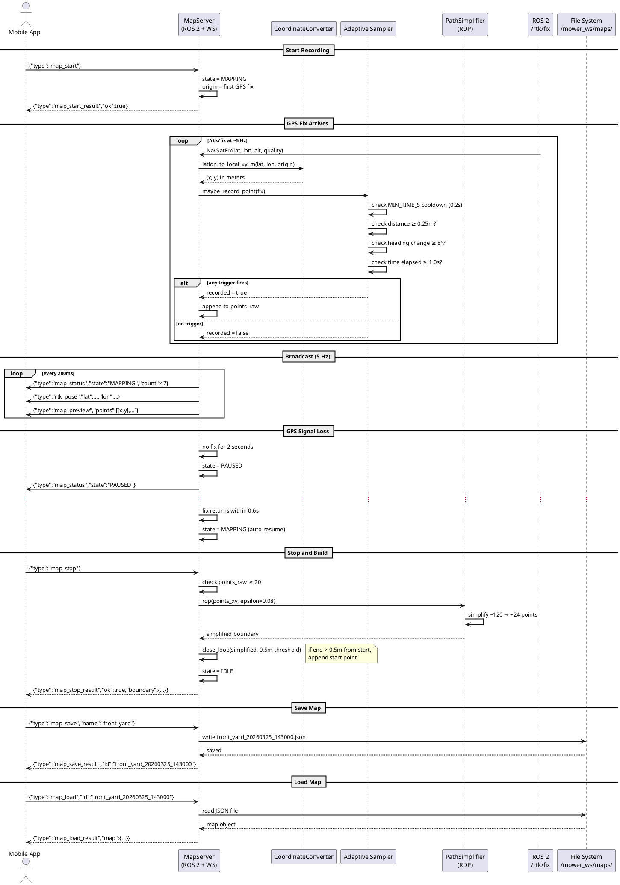
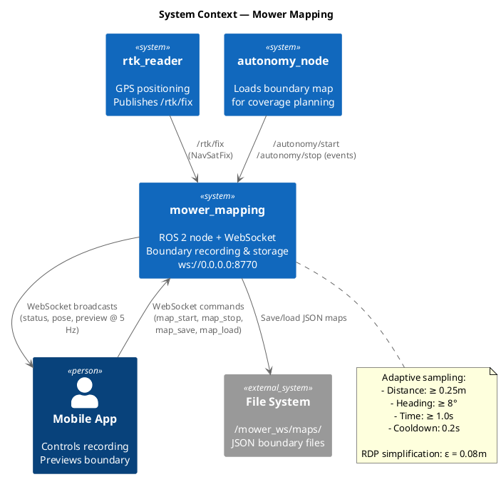

# Software Design — Mower Mapping (`mower_mapping`)

## 1. Overview

The `mower_mapping` package implements a ROS 2 node with an embedded WebSocket server (port 8770) that records GPS boundary polygons defining mowing areas. It subscribes to `/rtk/fix` for GPS position, applies adaptive sampling to capture boundary geometry efficiently, simplifies paths using the Ramer-Douglas-Peucker algorithm, and stores maps as JSON files.

### 1.1 Design Rationale

The mapping subsystem combines a ROS 2 subscriber (for GPS data) with a WebSocket server (for mobile app control) in a single node. This hybrid approach allows the mobile app to control recording sessions and preview boundaries in real time without requiring ROS 2 on the phone. Adaptive sampling captures corners with high resolution while keeping straight edges sparse.

### 1.2 Key Responsibilities

- Subscribe to `/rtk/fix` and convert GPS coordinates to local Cartesian meters
- Record boundary points using adaptive sampling (distance, heading, and time triggers)
- Simplify recorded paths using RDP algorithm (epsilon = 0.08 m)
- Manage recording state machine (IDLE → MAPPING → PAUSED → IDLE)
- Auto-pause on GPS signal loss, auto-resume on recovery
- Save/load/list maps as JSON in `~/mower_ws/maps/`
- Broadcast status, RTK pose, and boundary preview to connected WebSocket clients at 5 Hz

---

## 2. Class Diagram



---

## 3. Sequence Diagram



---

## 4. System Context Diagram



---

## 5. Detailed Design

### 5.1 Coordinate Conversion

GPS coordinates (latitude, longitude) are converted to local Cartesian meters using the equirectangular approximation:

```
x = (lon - lon₀) × R × cos(lat₀) × π/180
y = (lat - lat₀) × R × π/180
```

where R = 6,371,000 m and (lat₀, lon₀) is the first recorded GPS fix, which becomes the local origin. This approximation is accurate within ~1 cm for areas under 1 km².

### 5.2 Adaptive Sampling Algorithm

A new boundary point is recorded when **any** of the following triggers fire:

| Trigger | Threshold | Purpose |
|---|---|---|
| Distance | ≥ 0.25 m | Ensures minimum spatial resolution |
| Heading change | ≥ 8° | Captures corners with high density |
| Time elapsed | ≥ 1.0 s | Prevents gaps on slow movement |

A minimum cooldown of 0.2 seconds prevents over-sampling. The result is dense points on curves and sparse points on straight edges.

### 5.3 Path Simplification (RDP)

After recording stops, the Ramer-Douglas-Peucker algorithm simplifies the raw boundary with epsilon = 0.08 m. This typically reduces point count by ~80% (e.g., 120 → 24 points) while preserving boundary shape within 8 cm accuracy. If the endpoint is more than 0.5 m from the start point, the start point is appended to close the polygon.

### 5.4 State Machine

| State | Description | Transitions |
|---|---|---|
| `IDLE` | Not recording | → `MAPPING` (on `map_start`) |
| `MAPPING` | Actively recording GPS points | → `PAUSED` (GPS loss > 2s), → `IDLE` (map_stop/cancel) |
| `PAUSED` | GPS lost, waiting for recovery | → `MAPPING` (GPS returns < 0.6s), → `IDLE` (map_cancel) |

### 5.5 WebSocket Protocol

**App → Server Commands:** `map_start`, `map_stop`, `map_save`, `map_list`, `map_load`, `map_cancel`

**Server → App Broadcasts (5 Hz):**

| Message | Content | When |
|---|---|---|
| `map_status` | state, point count | Always |
| `rtk_pose` | lat, lon, timestamp | When GPS fix available |
| `map_preview` | boundary [[x,y],...] | During MAPPING/PAUSED |

### 5.6 Map Storage

Maps are stored as JSON files in `~/mower_ws/maps/` with naming convention `<name>_<YYYYMMDD_HHMMSS>.json`. Each file contains the simplified boundary polygon (local XY coordinates), GPS origin coordinates, metadata (point count, creation time), and the raw GPS coordinates for reference.
