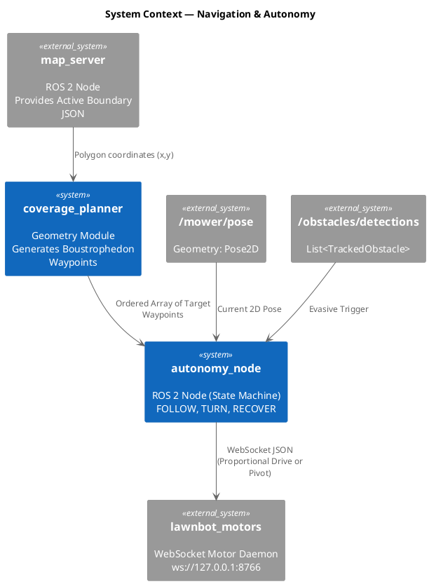
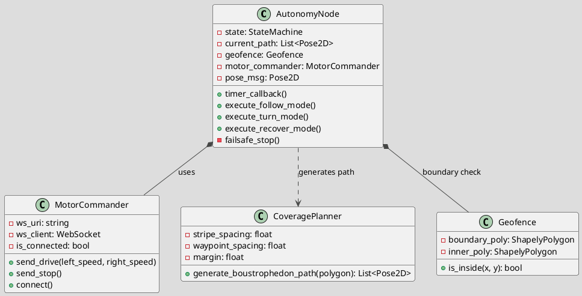

# Navigation & Autonomy: Software Design

> **Note:** The `mower_navigation` package and Nav2 integration are deprecated. The autonomy state machine and coverage path planning are now actively performed by `mower_autonomy/autonomy_node.py` and `mower_autonomy/coverage_planner.py`. This design document reflects the active autonomy implementation.

## 1. System / Component Diagram

This diagram maps the autonomous state machine to the map definitions and underlying motor hardware.



### Component Details
- **autonomy_node**: Subscribes to `/mower/pose` and calculates raw differential drive commands (proportional P controller) to steer the robot toward successive waypoints. Checks the geofence to prevent leaving the active bounds.
- **coverage_planner**: Utilizes the `shapely` python library to shrink the user's mapped perimeter polygon and slice it into safe, continuous boustrophedon (zigzag) stripes.

---

## 2. Class Diagram



### Class Details
- **AutonomyNode (State Machine)**: Iterates through discrete active behaviors sequence: `IDLE`, `FOLLOW`, `TURN`, `RECOVER`, `DONE`.
- **MotorCommander**: Bypasses the traditional ROS 2 `/cmd_vel` pipeline using asynchronous websocket events connecting directly to the motor daemon, ensuring instant throttle cut-offs.
- **Geofence**: A geometric buffer validating that every localized tick (x,y) resides within the pre-recorded map frame. Drops the state machine to `RECOVER` mode if breached.

---

## 3. Sequence Diagram

This sequence details the generation of a coverage path and the decision loop when encountering obstacles mid-route.

```plantuml
@startuml
!theme toy

actor Admin
participant "map_server" as Map
participant "autonomy_node" as Auto
participant "obstacle_detector" as Obs
participant "lawnbot_motors" as Motors

Admin -> Map : Start Active Mowing
Map -> Auto : Publish /autonomy/start
Auto -> Map : Request Active Boundary JSON
Map --> Auto : Return Boundary Polygon
Auto -> Auto : CoveragePlanner.generate_boustrophedon()
Auto -> Auto : State = FOLLOW

loop Control Loop (20 Hz)
    
    %% Obstacle Check %%
    Obs -> Auto : Publish /obstacles/detections
    alt Obstacle < 0.25m and in_path == true
        Auto -> Auto : Evaluate Side Clearance
        Auto -> Motors : WS: {cmd: "drive", left: -0.4, right: 0.4}
        note right: Evasive Pivot Turn
    else Clear Path
        Auto -> Auto : Calculate Bearing Error to Waypoint
        
        alt Large Heading Error
            Auto -> Motors : WS: Pivot commands
        else Good Heading
            Auto -> Motors : WS: Proportional straight drive
        end
    end
    
    %% Geofence Check %%
    Auto -> Auto : Geofence.is_inside(current_x, current_y)
    alt Outside Boundary
        Auto -> Auto : State = RECOVER
        Auto -> Motors : WS: Stop
    end
end

Admin -> Map : Stop Mowing
Map -> Auto : Publish /autonomy/stop
Auto -> Motors : WS: {cmd: "stop", force: true}
Auto -> Auto : State = IDLE

@enduml
```

### Sequence Flow Details
- **Path Generation Phase**: Upon start, the node consumes the `map_server` JSON string and blocks briefly to calculate intersecting horizontal scan lines across the convex shape.
- **Tracking Phase**: Every 1/20th of a second, the robot steers its heading toward the active waypoint, dwelling on tight turns.
- **Evasive Phase**: The system natively understands its clearance. An obstacle immediately pauses tracking to execute a reverse or pivot maneuver, returning tracking when the cone intersects clear space.
