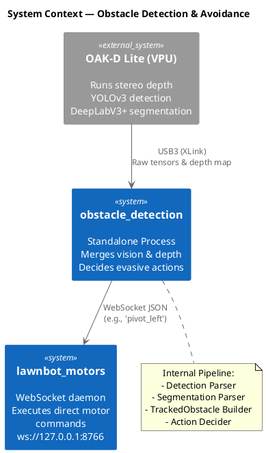
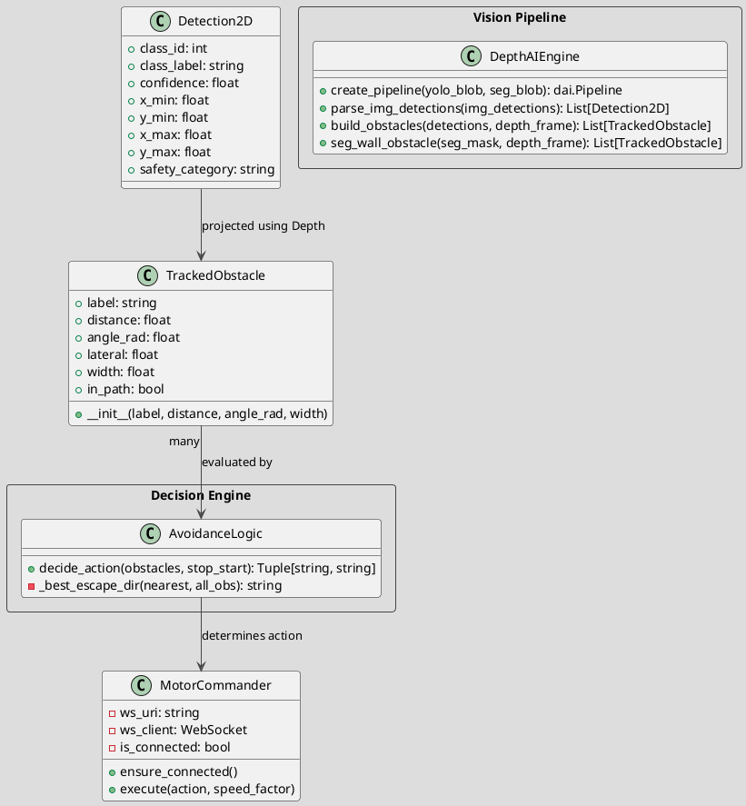
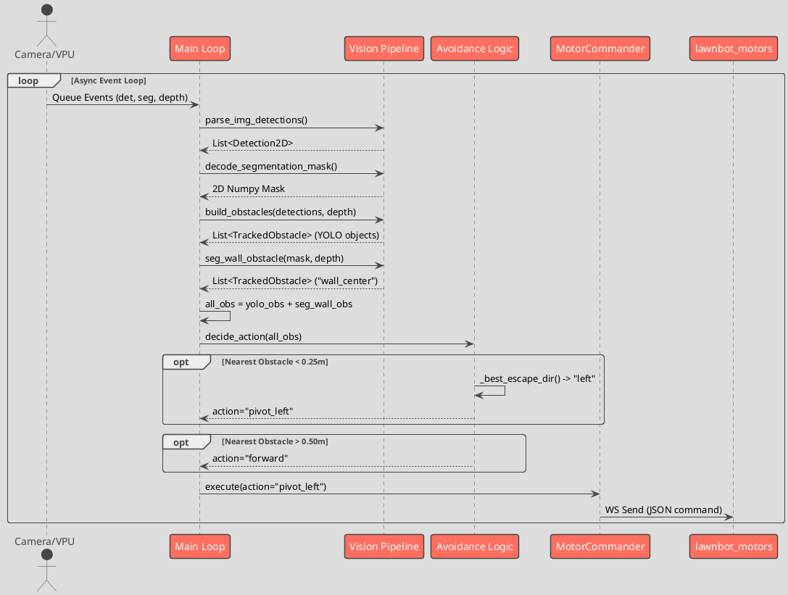

# Obstacle Detection & Avoidance: Software Design

## 1. System / Component Diagram

The system diagram illustrates the dual vision models running on the camera's VPU and how the host process interacts with the mower's motor server.

### Component Details
1. **OAK-D Lite VPU Pipeline**: The intensive ML work is offloaded to the camera. It runs three parallel nodes: Stereo Depth, YOLO object detection (people, animals, etc.), and DeepLabV3+ semantic segmentation (drivable vs. non-drivable surfaces).
2. **Host Processing (`obstacle_avoidance_full.py`)**: 
   - **Detection Parser**: Decodes raw YOLO outputs.
   - **Segmentation Parser**: Evaluates the bottom 60% of the image (the immediate path) by splitting it into Left, Center, Right columns and counting "red" (non-drivable) pixels.
   - **TrackedObstacle Builder**: Merges YOLO objects and Segmentation walls, using depth map values.
3. **Action Decider**: Distance-layered decision engine that chooses navigation commands based on the closest obstacle.

---

## 2. Class Diagram

### Class Details
- **TrackedObstacle**: Represents a physical object mapped into 3D space. It calculates its `lateral` displacement from the camera origin and determines if it is `in_path`.

---

## 3. Sequence Diagram

This sequence illustrates a single loop where an obstacle is detected, merged, and evaded.

### Sequence Flow Details
- **Data Acquisition**: Non-blocking extraction of asynchronous neural network results and depth frames.
- **YOLO & Segmentation Resolution**: Objects and Semantic boundaries are independently resolved using the depth mask.
- **Action Determination**: Merged list is prioritized by distance to determine immediate safe vectors.
