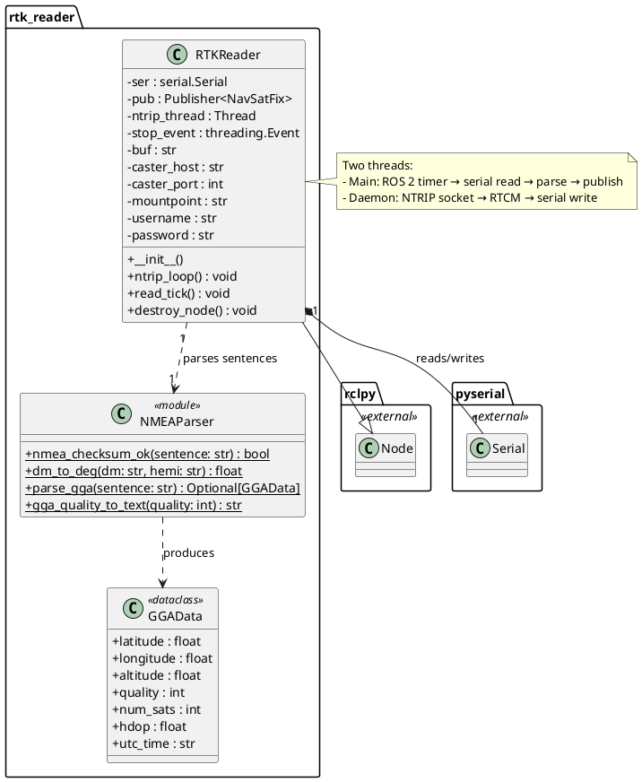
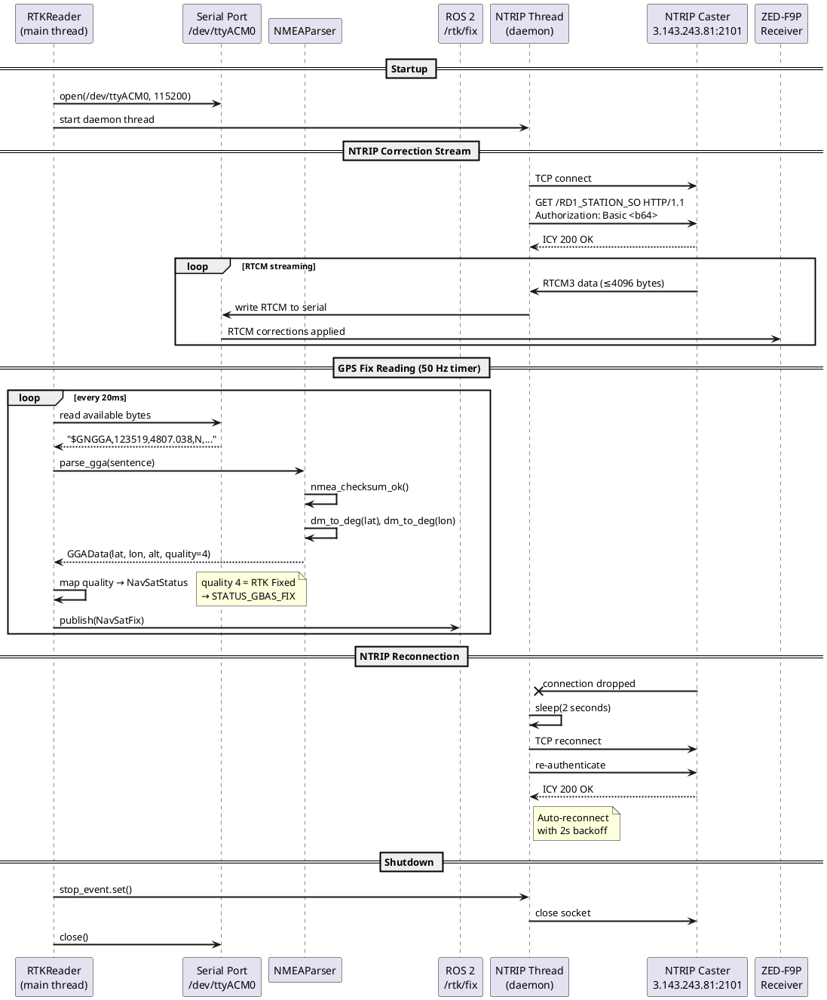
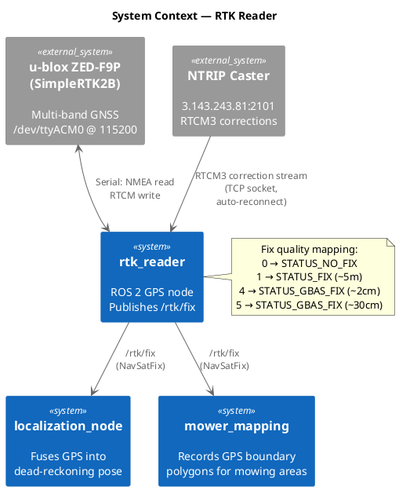

# Software Design — RTK Reader (`rtk_reader`)

## 1. Overview

The `rtk_reader` package implements a ROS 2 node that interfaces with a u-blox ZED-F9P GNSS receiver (SimpleRTK2B board) over serial, parses NMEA GGA sentences, and publishes `sensor_msgs/NavSatFix` on `/rtk/fix`. A background NTRIP client streams RTCM3 correction data from a remote base station to the receiver, enabling centimeter-level RTK positioning.

### 1.1 Design Rationale

The node uses raw serial I/O and manual NMEA parsing (no external NMEA library) for minimal dependencies and full control over sentence validation. The NTRIP client runs in a separate daemon thread to avoid blocking the ROS 2 timer that reads and publishes GPS fixes. Serial port access is shared between the main thread (read NMEA) and the NTRIP thread (write RTCM corrections).

### 1.2 Key Responsibilities

- Read NMEA GGA sentences from the ZED-F9P serial port at 50 Hz
- Parse latitude, longitude, altitude, and fix quality with checksum validation
- Map GGA fix quality to `NavSatStatus` values
- Publish `sensor_msgs/NavSatFix` on `/rtk/fix`
- Stream NTRIP RTCM3 corrections to the receiver in a background thread
- Auto-reconnect on NTRIP connection loss with 2-second backoff

---

## 2. Class Diagram

---

## 3. Sequence Diagram

---

## 4. System Context Diagram

---

## 5. Detailed Design

### 5.1 NMEA Parsing

The parser is implemented without external NMEA libraries. It directly splits GGA sentences on commas and validates using XOR-based NMEA checksum. The `dm_to_deg()` function converts NMEA's degrees-minutes format (`DDMM.MMMMM`) to decimal degrees. Only `$GNGGA` and `$GPGGA` sentence types are processed; all others are discarded.

### 5.2 Fix Quality Mapping

| GGA Quality | Description | NavSatStatus | Typical Accuracy |
|---|---|---|---|
| 0 | No fix | `STATUS_NO_FIX` | N/A |
| 1 | GNSS autonomous | `STATUS_FIX` | ~5 m |
| 2 | DGPS | `STATUS_GBAS_FIX` | ~1 m |
| 4 | RTK Fixed | `STATUS_GBAS_FIX` | ~2 cm |
| 5 | RTK Float | `STATUS_GBAS_FIX` | ~30 cm |

### 5.3 NTRIP Client

The NTRIP client connects via raw TCP socket and sends an HTTP-style GET request with Basic authentication (Base64-encoded credentials). The connection sequence:

1. Open TCP socket to `caster_host:caster_port`
2. Send `GET /mountpoint HTTP/1.1` with `Authorization: Basic <credentials>`
3. Verify `200 OK` or `ICY 200 OK` in the response header
4. Enter streaming loop: read RTCM3 data (up to 4096 bytes per read) and write to serial
5. On disconnect: close socket, wait 2 seconds, reconnect

### 5.4 Threading Model

| Thread | Responsibility | Frequency |
|---|---|---|
| Main (ROS 2 timer) | Serial read → NMEA parse → publish `/rtk/fix` | 50 Hz |
| NTRIP daemon | Socket recv → serial write (RTCM corrections) | Continuous |

The `threading.Event` (`stop_event`) coordinates graceful shutdown. The NTRIP thread runs as a daemon so it is killed if the main thread exits unexpectedly.

### 5.5 Serial Configuration

| Parameter | Value |
|---|---|
| Device | `/dev/ttyACM0` |
| Baud rate | 115200 |
| Data bits | 8 |
| Parity | None |
| Stop bits | 1 |

### 5.6 Error Handling

| Failure | Detection | Response |
|---|---|---|
| Serial port error | Exception on read | Log error, retry on next tick |
| NTRIP disconnect | Socket closed/timeout | Auto-reconnect after 2s backoff |
| Invalid NMEA sentence | Checksum mismatch | Discard, continue |
| No RTK fix | GGA quality < 4 | Publish with degraded status |
| GPS data timeout | No GGA sentence for 5s | Log warning |
