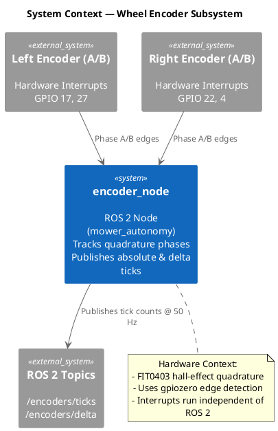
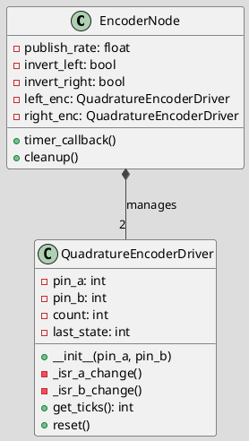
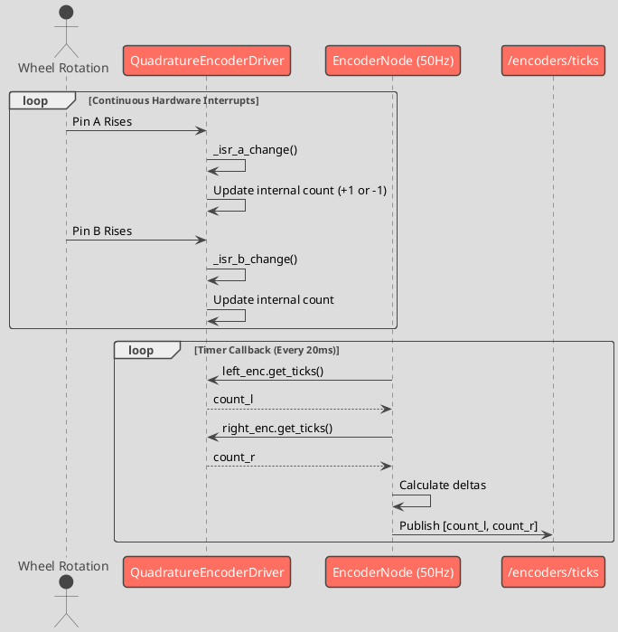

# Wheel Encoder Subsystem: Software Design

> **Note:** The `wheel_encoder` package is deprecated. Encoder reading is now actively performed by `mower_autonomy/encoder_node.py`. This design document reflects the active encoder implementation.

## 1. System / Component Diagram

This diagram shows the relationship between the physical encoders, the ROS 2 node, and its outputs.

### Component Details
- **encoder_node**: Directly interfaces with FIT0403 hall-effect quadrature encoders via hardware interrupts (`gpiozero`). Converts rapid phase changes into continuous tick counts.
- **/encoders/ticks**: Publishes the absolute running tick count (Int32MultiArray) at 50 Hz. Used by `localization_node` to compute distance traveled and by `autonomy_node` for precise 180° turns.
- **/encoders/delta**: Publishes tick changes since the last cycle. 

---

## 2. Class Diagram

### Class Details
- **EncoderNode**: Subclasses `rclpy.node.Node`, running a fixed 50 Hz control timer that triggers data publishing.
- **QuadratureEncoderDriver**: A low-level interrupt handler. Uses edge-triggered callbacks to evaluate the phase relationship between Channel A and B, accurately tracking forward and reverse rotation. 

---

## 3. Sequence Diagram

This sequence diagram illustrates a single execution loop of the encoder node reading hardware ticks and publishing them.

### Sequence Flow Details
- **Interrupt Mode**: Ticks are accumulated independently of the ROS 2 event loop via fast C-level `gpiozero` edge interrupts. This ensures no ticks are missed even under heavy CPU load.
- **Publish Mode**: Every 20ms, the ROS 2 node samples the latest tick count and calculates the delta from the last sample, providing precise 50 Hz data points downstream constraints.
